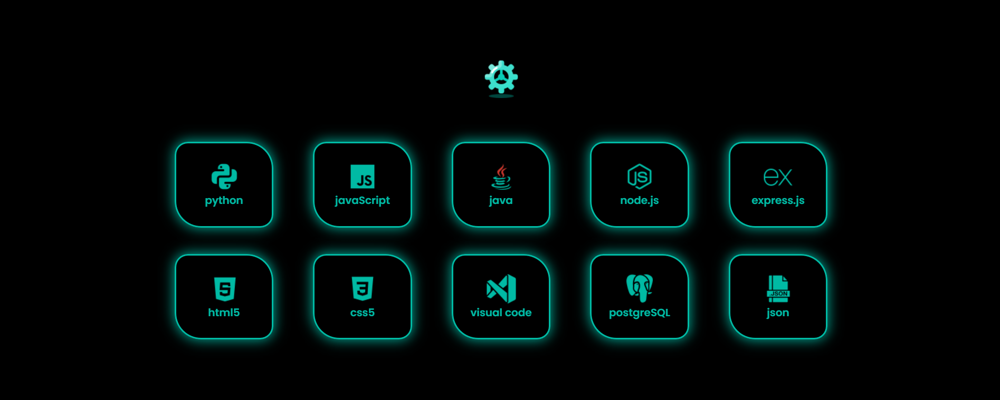
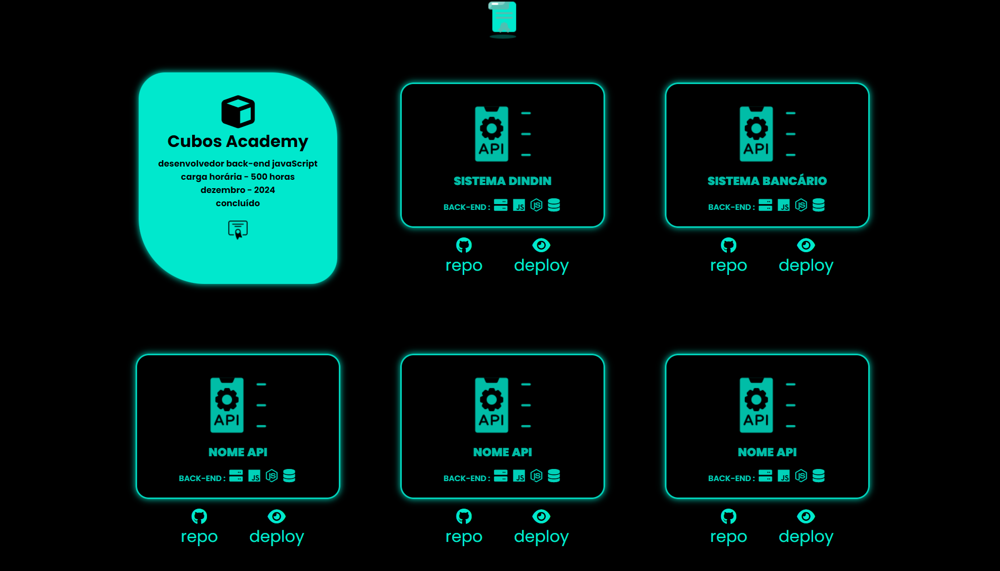

# Portfolio de Projetos e Qualificações

Este é o meu portfólio pessoal, destacando minha jornada acadêmica, habilidades técnicas e projetos pessoais. Desenvolvido utilizando HTML5, CSS3 e JavaScript, este portfolio oferece uma visão abrangente das minhas realizações e experiências.

## `Estrutura`

#### **Página Inicial:**

_Apresentação breve e direta sobre mim, destacando meus objetivos e áreas de interesse._

#### **Tecnologis e Ferramentas:**

_Botões interativos com as principais tecnologias e ferramentas que uso para o desenvolvimento de projetos._

#### **Graduação:**

_Detalhes sobre minha formação acadêmica, incluindo cursos, período e instituição de ensino._

#### **Habilidades Técnicas:**

_Em cada projeto, haverá icones com as habilidades usadas, destacando quais foram as principais tecnologias utilizadas para o seu desenvolvimento._

#### **Projetos:**

_Destaques dos projetos acadêmicos e pessoais mais significativos. Inclui artigos, publicações ou demonstrações online._

#### **Qualificações:**

_Certificações e qualificações relevantes que adquiri ao longo da minha jornada._

#### **Contato:**

_Informações para entrar em contato comigo, incluindo links para redes sociais._

## `Tecnologias Utilizadas`

#### **HTML5:**

_Estruturação semântica para uma navegação e acessibilidade eficazes._

#### **CSS3:**

_Estilo moderno e responsivo para uma experiência visual atraente e consistente._

#### **JavaScript:**

_Interações dinâmicas para aprimorar a usabilidade e proporcionar uma experiência de usuário mais envolvente._

#### `Como Contribuir`

_Fique à vontade para explorar, sugerir melhorias ou até mesmo contribuir para o desenvolvimento deste portfolio. Sua opinião é valiosa!_

### `Licença`

_Este projeto está licenciado sob a Licença MIT - sinta-se à vontade para utilizar, modificar e distribuir conforme necessário._

#### _Espero que este portfolio ofereça uma visão clara e envolvente do meu percurso acadêmico e habilidades técnicas. Se tiver alguma dúvida ou sugestão, entre em contato!_

#

#### _imagens do projeto_

#

###### `imagem:`

#

###### `imagem:`

#

###### `imagem:`

#

###### `imagem:`

#

###### `imagem:`

#

###### `imagem:`

#

### _Obrigado por visitar!_

#
